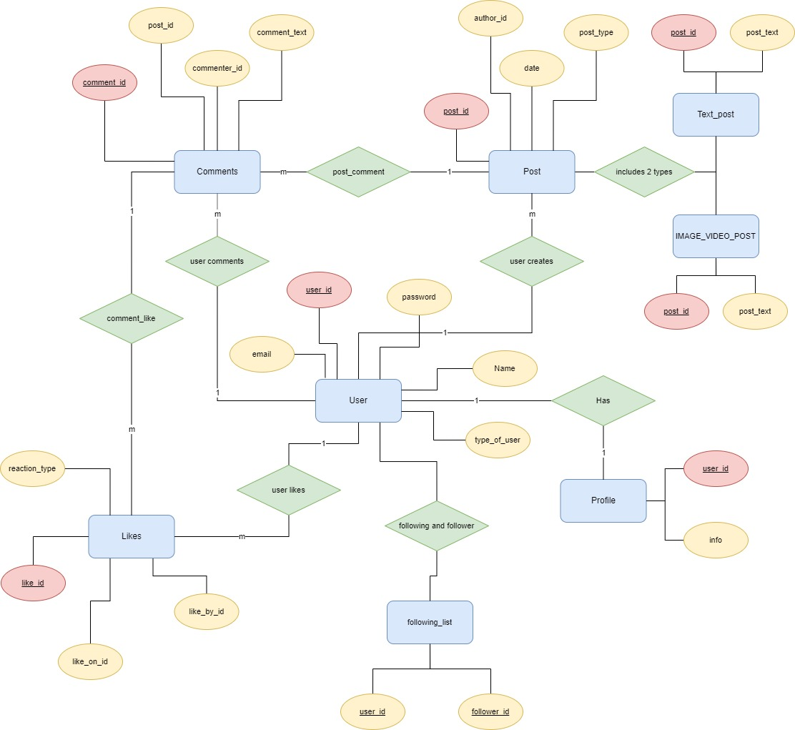
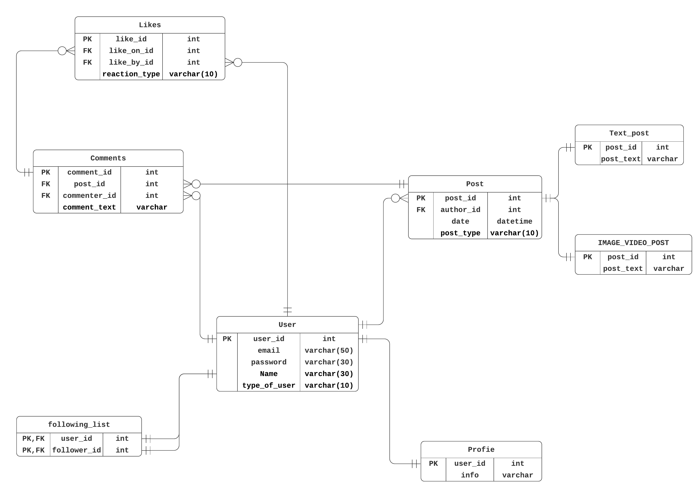

# Persistence
## 1. List of entities, properties

<table>

<thead>
    <tr>
        <th>Entity</th>
        <th>Property</th>
        <th>Comment</th>
    </tr>
</thead>

<tbody>
    <!-- User -->
    <tr>
        <td rowspan=5>User</td>
        <td>user_id</td>
        <td>Key property for this entity. User ID is generated automatically.</td>
    </tr>
    <tr>
        <td>email</td>
        <td>User's email address.</td>
    </tr>
    <tr>
        <td>password</td>
        <td>User's password.</td>
    </tr>
    <tr>
        <td>Name</td>
        <td>User's name to be displayed on website.</td>
    </tr>
    <tr>
        <td>type_of_user</td>
        <td>This property can be user or admin.</td>
    </tr>        
    <!-- Profile -->
    <tr>
        <td rowspan=2>Profile</td>
        <td>user_id</td>
        <td>User's ID</td>
    </tr>
    <tr>
        <td>info</td>
        <td>All information about user displayed like json file.</td>
    </tr>
    <!-- following_list -->
    <tr>
        <td rowspan=2>following_list</td>
        <td>user_id</td>
        <td>This is a foreign key property.</td>
    </tr>
    <tr>
        <td>follower_id</td>
        <td>This is a foreign key property.</td>
    </tr>
    <!-- Post -->
    <tr>
        <td rowspan=4>Post</td>
        <td>post_id</td>
        <td>Each post has a key ID.</td>
    </tr>
    <tr>
        <td>author_id</td>
        <td>ID of the creator of this post.</td>
    </tr>
    <tr>
        <td>date</td>
        <td>Date created.</td>
    </tr>
    <tr>
        <td>post_type</td>
        <td>This property value can be TEXT or IMAGE_VIDEO</td>
    </tr>
    <!-- Text_post -->
    <tr>
        <td rowspan=2>Text_post</td>
        <td>post_id</td>
        <td>Post ID</td>
    </tr>
    <tr>
        <td>post_text</td>
        <td>Post content.</td>
    </tr>
    <!-- vidpost -->
    <tr>
        <td rowspan=2>IMAGE_VIDEO_POST</td>
        <td>post_id</td>
        <td>Post ID</td>
    </tr>
    <tr>
        <td>post_text</td>
        <td>Post content, including url to file location of image or video.</td>
    </tr>    
    <!-- Comment -->
    <tr>
        <td rowspan=4>Comments</td>
        <td>comment_id</td>
        <td>Comment ID.</td>
    </tr>
    <tr>
        <td>post_id</td>
        <td>Post ID that contains this comment</td>
    </tr>
    <tr>
        <td>commenter_id</td>
        <td>ID of Commenter.</td>
    </tr>
    <tr>
        <td>comment_text</td>
        <td>Content of this comment.</td>
    </tr>
    <!-- Likes -->
    <tr>
        <td rowspan=4>Likes</td>
        <td>like_id</td>
        <td>ID of this like</td>
    </tr>
    <tr>
        <td>like_on_id</td>
        <td>Comment ID that receives reaction.</td>
    </tr>
    <tr>
        <td>like_by_id</td>
        <td>who reacted to this.</td>
    </tr>
    <tr>
        <td>reaction_type</td>
        <td>This field can take values of upvote(agree) or downvote(unsupport)</td>
    </tr>
</tbody>
</table>

<strong>Relationships:</strong>
<ul>
    <li>One-to-many relationship (user creates) between User and Post. A User may create several posts.</li>
    <li>One-to-many relationship (user comments) between User and Comments. A User may comments multiple times.</li>
    <li>One-to-many relationhsip (user likes) between User and Likes. A User may have various likes from post's comments.</li>
    <li>One-to-many relationship (comment_like) between Likes and Comments. A comment can receive numerous likes.</li>
    <li>One-to-one relationship (Has) between User and Profile. Each User has one and only one Profile.</li>
    <li>One-to-many relationship (post_comment) between Post and Comments. A Post can have lots of comments.</li>
</ul>

## 2. Entity Relasionship Diagram

## 3. Database model:

