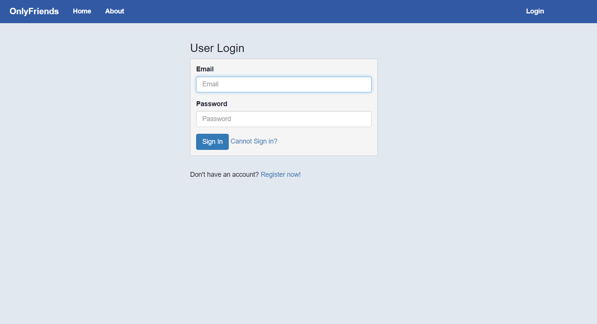
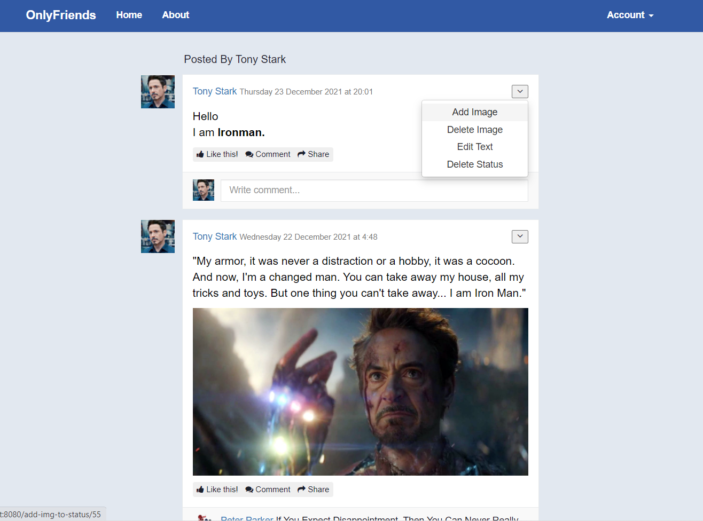
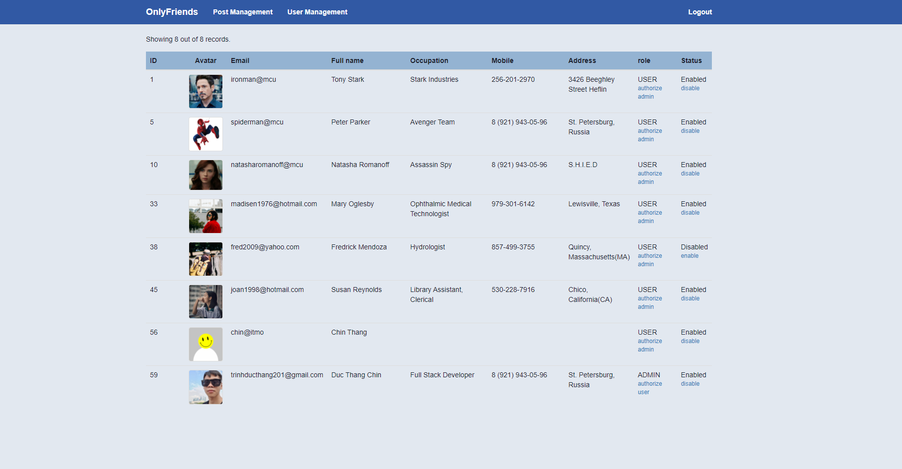

<h1> Interface Design</h1>
<h2> List of Interfaces</h2>
<ul>
  <li>
    <h3>Not Authenticated</h3>
    <ul>
      <li><a href="#login">Login page</a>: Before authentication, if the user tries to access any url, it will automatically redirect to <a href="#login">login page.</a></li>
      <li><a href="#register">Register page.</a></li>
      <li><a href="#verify">Verification page</a></li>
      <li><a href="#message">Message page</a>: After registering, the user needs to click on the link that sent to the user's email in order to activate account. The link is basicly a request contains token as request param. After that, it will direct to the message page, whose content is:
        <ul>
          <li>Registration confirmed. You can now log in.</li>
          <li>This token has expired.</li>
          <li>Invalid user</li>
        </ul>
        Besides, a <a href="#message">message page</a> with content "Access denied" will appear when an error code 403 occurs in sever.
      </li>
    </ul>
  </li>
  
  <li>
    <h3>User</h3>
    <ul>
      <li>
        <a href="#feed">News feed page</a>: Display of statuses and comments on them. If a comment is commented by the user, there will be a link button "delete" allows the user to delete that comment. At the footer of a Status, there is a comment box, where the user can post a comment.
      </li>
      <li>
        <a href="#addStatus">Add status page</a>: When the user is authenticated, there will be a link button navigating to <a href="#addStatus">add status page</a>. After clicking on addStatus(submit) button, a post request will be sent and the website will navigate to <a href="#feed">New feed page</a>.
      </li>
      <li>
        <a href="#editStatus">Edit status Page</a>: It's quite similar to <a href="#addStatus">add status page</a>.
      </li>
      <li>
        <a href="#about">About page</a>: This is profile page showing information of the user. There will be an Edit button, navigating to <a href="editProfile">edit profile page</a>. If the user go to other profile page, there will be only display of information of that user without button Edit.
      </li>
      <li>
        <a href="#editProfile">Edit Profile page</a>: User can change personal information and change profile photo(avatar).
      </li>
      <li>
        <a href="#home">Home page</a>: Display all statuses owned by the User. More over the user can add image to status, delete image of the status, edit status text and permanently delete that status.
      </li>
      <li>
        <a href="#uploadImg">Upload Image page</a>: This page appears when the user changes profile photo and add image to his status.
      </li>
    </ul>  
  </li>
  
  <li>
    <h3>Admin</h3>
    <ul>
      <li>
        <a href="#userManagement">User Management Page</a>: User with role ADMIN can see all user and disable any user.
      </li>
      <li>
        <a href="#statusManagement">Status Management Page</a>: User with role ADMIN can see all statuses and comments, he should be able to delete them as well.
      </li>
    </ul>
    
  </li>
</ul>

<h2>Interface Schetches</h2>
<ol>
  <li>
    <h3 id="login">Login page</h3>
    <ul>
      <li>
        login page
        
      </li>
      <li>
        login page with error
        
      </li>
    </ul>
    
  
  <li>
    <h3 id="register">Register page</h3>
    <ul>
      <li>
        register
        
      </li>
      <li>
        register-error
        
      </li>
    </ul>
  </li>
  
  <li>
    <h3 id="verify">Verification page</h3>
    
  </li>
  
  <li>
    <h3 id="message">Message page</h3>
    
  
   <li>
    <h3 id="feed">News feed page</h3>
    
   </li>
  
   <li>
    <h3 id="addStatus">Add Status page</h3>
    
   </li>
  
  <li>
    <h3 id="editStatus">Edit Status page</h3>
    
  </li>
  
   <li>
    <h3 id="about">About page</h3>
    
   </li>
  
   <li>
    <h3 id="editProfile">Edit Profile page</h3>
    
   </li>
  
   <li>
    <h3 id="home">Home page</h3>
    
   </li>
  
   <li>
    <h3 id="uploadImg">Upload Image page</h3>
     <ul>
       <li>
          upload profile image
          
       </li>
       <li>
          upload status image
          
       </li>
     </ul>
   </li>
  
  <li>
    <h3 id="userManagement"> User Management page</h3>
    
  </li>
  
  <li>
    <h3 id="statusManament"> Status Management page</h3>
    
  </li>
</ol>

<h2>Interface Diagram</h2>

