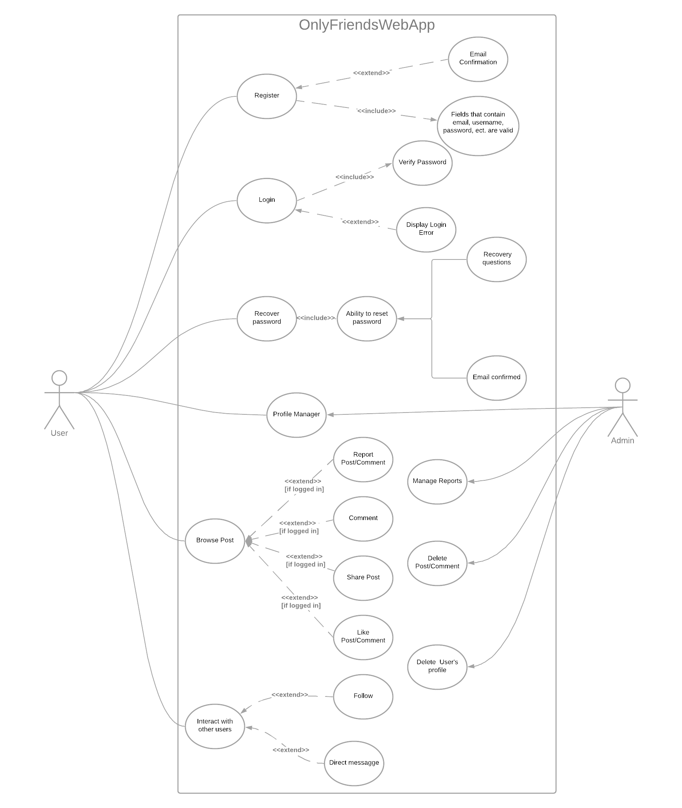

# Designing Use Case

## 1. List of Actors
 - Admin: Administrator who runs the website has the rights to manage video/post, delete inappropriate comments, ban a user forever or send a warning.
 - User: Can be a registered user or guest. A registed user has ability to manage his own account, public a new post, interact with other users and their post as well. Otherwise, a user who hasn't logged in or signed up for a new account considered a guest can only browse other posts.

## 2. Use Case Diagram

## 3. Use Case specifications
|Use cases|Discription|Actor|Preconditions|Main stream|Sub stream|Postconditions|
|-------------|-----------------|-------------------|--------------------|-----------|--------------|-------------|
|Register|User can create a new account|User| User has no account and wishes to make a new one |User will fill out a registration form with basic information|If the informationa entered is not in the correct format or account already exists in the system, the user is forced to reenter it|If the the information entered is successful, a new account will be created. Incase the user enterd email, the user need to confirm that email.|
|Login| Sign in the website| User|User has a created account|User enters the login field with email or username and password|If the login information entered incorrectly, the user needs to fill in again.|With the correct login, the user will be directed to the main page of website and will be able to use some special features|
|Recover Password|To regenerate password|User|The user forgets password. This account must be set recovery questions or have email confirmed|The user may choose some recovery questions and answer them. All of which should be correct in two times. If the user has email confirmed, a veryfication code will be sent.|If the user gives incorrect answers more than two times, he need to re-answer after 30 minutes. If the code enterd by the user doesn't match the code sent by the system, the user can resend verification code after 2 minutes|Having comfirmed by the system that the user owns this account, he can set a new password straight away.|
|Profile Manager|Edit profile, manager owned posts|Admin and User |User or Admin logged in the system |Add information, delete/edit post, upload profile photo, change password, ect.|-|After user saves change, system update that account's profile|
|Browse Post|Stream videos, see posts and read comments on the website|User|-|The user can scroll up and down to load new posts|If the user who hasn't logged in system interacts with post and other users, the website will torward to login/sign up page. For registered user, he can report violation, react to post, leave comments and share |-|
|Interactwith other users|Conectivity between users|User|User logged in system|User should be able to follow other users and send direct messages|-|-|
|Manager Reports|Display violations|Admin|Logged in as admin|The admin should be able to read add violations reported by user|-|-|
|Delete Post/Comment|Remove inapropriate posts/comments|Admin|Logged in as admin|The admin should be able to delete any post/comment|-|That post/comment no longer appears|
|Delete User's profile|Remove toxic users|Admin|Logged in as admin|The admin should be able to remove any account|-|That account will be removed forever|

